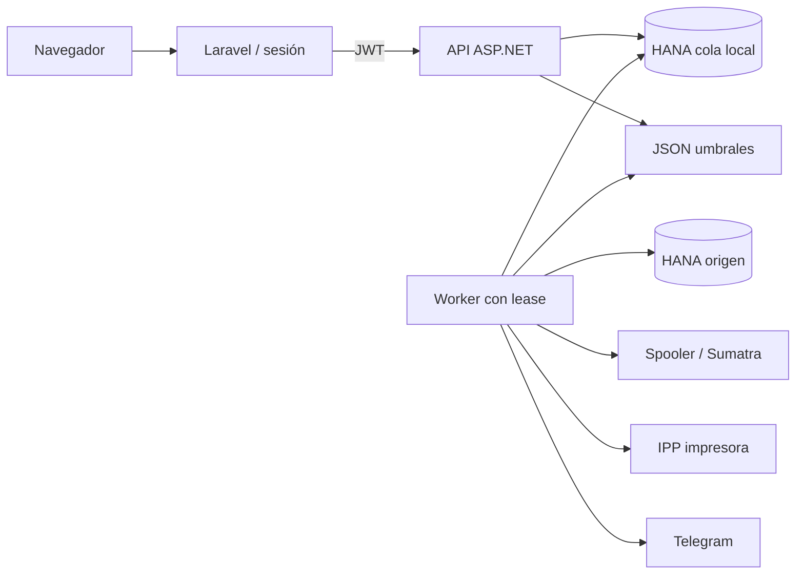

# Auditoría técnica integral — ImpresorasServiceV1

## Portada

| Campo | Valor |
| --- | --- |
| Proyecto | ImpresorasServiceV1 |
| Fecha | 2026-07-29 |
| Versión analizada | `main` en `49a0b9691e484472fb1da23417de172f1e60473f` |
| Commit fechado | 2026-07-29 11:31:26 +02:00 |
| Alcance | Repositorio completo: API, Worker, Core, Laravel/Blade, tests, configuración, CI, SQL, despliegue y documentación |
| Autor | Codex, auditoría técnica asistida |
| Acceso | Lectura/escritura local; sin credenciales HANA, impresoras, Telegram, red productiva ni telemetría |

## Resumen ejecutivo

La aplicación posee una arquitectura reconocible, controles de acceso por rol, lock de Worker, trazabilidad de estados, CI y una suite .NET amplia. Compila, el frontend genera sus assets y 142/142 pruebas .NET pasan. Sin embargo, **no debería considerarse lista para un despliegue sin remediación dirigida**: existe una credencial de Telegram real aún versionada; dependencias PHP bloqueadas con avisos conocidos; y defectos de integridad que pueden enviar un documento a otra tienda, perder un trabajo en ingesta, duplicar una impresión tras un reinicio o conservar PDFs indefinidamente.

El riesgo global es **alto**. No se asigna gravedad crítica porque no se demostró compromiso completo, fuga masiva ni pérdida generalizada en un entorno real. Las prioridades inmediatas son revocar el token, actualizar dependencias afectadas y fijar los contratos de tienda, concurrencia, impresión ambigua y retención. La conclusión sobre HANA, spooler, IPP y red es necesariamente parcial porque esos sistemas no estuvieron disponibles.

## Alcance y limitaciones

### Revisado y ejecutado

- 109 archivos C#, 86 PHP, Blade/JS/CSS, 13 SQL, scripts PowerShell, CI y documentación.
- Flujo navegador → Laravel → API → HANA y Worker → spooler/IPP/Telegram.
- Autenticación/autorización, CRUD, ingesta, routing, cola, impresión, watchdog, dashboard, alertas, borrado y despliegue.
- `dotnet test ImpresorasServiceV1.sln --no-restore`: **142/142** correctos.
- `php artisan test`: **11 correctos, 1 fallo**.
- `npm run build`: correcto.
- `composer audit --locked`: **16 avisos en 4 paquetes**.
- `dotnet list package --vulnerable --include-transitive`: un advisory alto en SQLite nativo de tests; proyectos productivos sin aviso.
- `npm audit --omit=dev`: 0 vulnerabilidades de producción.
- Escaneo estático del árbol e historial Git para la credencial identificada, sin contactar Telegram.

### No verificable

- Catálogo, constraints, índices, planes, cardinalidades, aislamiento y SQL real de SAP HANA.
- Driver HANA, SumatraPDF, Windows spooler, impresoras/IPP y comportamiento de red/firewall/proxy.
- Validez actual del token expuesto.
- Datos/volumen productivo, telemetría, SLO, backup, restore, RPO/RTO y procedimiento operativo.
- Pentest, DAST, E2E navegador, accesibilidad automatizada, carga, caos y compatibilidad de dispositivos.

## Inventario técnico

El inventario exhaustivo está en [inventario-tecnico.md](inventario-tecnico.md). Componentes principales: API ASP.NET Core 8, Worker Windows .NET 8, dominio/infraestructura compartida, SAP HANA, frontend/BFF Laravel 12/Blade/Vite, Windows spooler/SumatraPDF, IPP y Telegram.

## Arquitectura observada

`Core` ofrece `Interface`/`Implementation` útiles para spooler, origen y routing, pero varios `Module` pierden profundidad: el aislamiento de tienda y la concurrencia se repiten en llamadores; dashboard/salud se duplican entre API, Worker y PHP. Los mejores `Seam` para remediar son una policy de ámbito, una transición atómica de PrintJob, un resolver por lote y un outbox de alertas.

## Resumen de hallazgos

| ID | Hallazgo | Categoría | Gravedad | Confianza | Estado | Esfuerzo |
| --- | --- | --- | --- | --- | --- | --- |
| AUD-01 | Token Telegram real sigue en Git | Seguridad | Alta | Alta | Confirmado | Bajo/Medio |
| AUD-02 | Lockfile PHP vulnerable y SQLite de tests afectado | Supply chain | Alta | Alta | Confirmado/Potencial | Bajo/Medio |
| AUD-03 | Update permite demover al último Admin | Autorización/funcional | Alta | Alta | Confirmado | Medio |
| AUD-04 | Aislamiento de tienda falla en abierto sin claim | Autorización | Media | Media | Probable | Medio |
| AUD-05 | Rate limit de login es global | Disponibilidad | Media | Alta | Confirmado | Bajo |
| AUD-06 | Sesión/JWT no se regeneran, invalidan ni revocan | Autenticación | Media | Alta | Confirmado | Medio |
| AUD-07 | `StoreId = 0` es válido solo en parte del sistema | Funcional | Alta | Alta | Confirmado | Medio |
| AUD-08 | Regla puede enrutar a impresora de otra tienda | Integridad/privacidad | Alta | Alta | Confirmado | Bajo/Medio |
| AUD-09 | Todo `DbUpdateException` se trata como duplicado y se ACKea | Datos | Alta | Alta | Probable | Medio |
| AUD-10 | Ventana spooler/commit permite duplicado físico | Concurrencia | Alta | Alta | Confirmado | Alto |
| AUD-11 | IPP `idle` se interpreta como job impreso | Funcional | Alta | Alta | Confirmado | Alto |
| AUD-12 | `RowVersion` no aplica concurrencia atómica | Concurrencia/datos | Alta | Alta | Confirmado | Alto |
| AUD-13 | PDFs duplicados y retenidos indefinidamente | Privacidad/rendimiento | Alta | Alta | Confirmado | Medio |
| AUD-14 | Alertas se confirman antes de enviarse | Fiabilidad | Media | Alta | Confirmado | Medio |
| AUD-15 | Borrado de tienda deja asociaciones/historial ambiguo | Datos | Media | Alta | Confirmado | Medio/Alto |
| AUD-16 | HTTP global y LocalSystem por defecto | Infraestructura | Media | Media | Potencial | Medio |
| AUD-17 | Routing repite tablas completas por job | Rendimiento | Media | Alta | Confirmado | Medio |
| AUD-18 | Dashboard agrega en memoria y búsqueda no indexable | Rendimiento | Media | Alta | Confirmado | Medio |
| AUD-19 | Alertas hacen N+1 por tienda | Rendimiento | Media | Alta | Confirmado | Medio |
| AUD-20 | JSON no atómico y lógica/dashboard sobredimensionados | Arquitectura | Media | Alta | Confirmado | Medio |
| AUD-21 | Fallos API se convierten en vacío/fallback engañoso | UX/errores | Media | Alta | Confirmado | Medio |
| AUD-22 | Observabilidad, backup y DR insuficientes | Operación | Media | Alta | Confirmado | Medio |
| AUD-23 | Suite PHP falla y faltan gates de sistema real | Pruebas | Media | Alta | Confirmado | Medio |
| AUD-24 | Headers/diagnóstico/DOM dejan defensa incompleta | Seguridad | Baja | Media | Potencial | Bajo/Medio |

## Hallazgos detallados

## AUD-01 Token de Telegram real permanece en el árbol y el historial

**Categoría:** Seguridad/secretos  
**Gravedad:** Alta · **Probabilidad:** Alta · **Impacto:** Alto · **Confianza:** Alta  
**Estado:** Confirmado  
**Componente afectado:** Documentación, Git, Telegram  
**Archivo o archivos:** `docs/auditoriaimpresoras.md`; historial de appsettings del Worker  
**Líneas aproximadas:** `auditoriaimpresoras.md:153`  
**Funcionalidad afectada:** Alertas Telegram y cadena de suministro

### Descripción

Una credencial con formato válido de bot se publica completa en un documento que, paradójicamente, afirma que ya no está en el árbol.

### Evidencia

Sin reproducir el secreto: longitud 46, fingerprint SHA-256 `D751A9E3FFB7`, 13 ocurrencias históricas, un token distinto, primera aparición 2026-06-29 y presencia en HEAD.

### Justificación técnica

Todo lector/clon y cualquier sistema que indexe Git puede reutilizarlo mientras sea válido. Eliminar solo la línea no revoca ni retira copias históricas.

### Escenario de reproducción

Buscar patrones de bot Telegram en archivos versionados/historial y comprobar la coincidencia de fingerprint; no es necesario llamar al tercero.

### Comportamiento actual

El token es recuperable desde HEAD e historial.

### Comportamiento esperado

Solo un secret store/entorno operativo contiene el token; Git contiene placeholders.

### Impacto real

Uso no autorizado del bot, lectura/envío según permisos, suplantación de alertas y coste de incidente.

### Alcance

Todos los chats y operaciones permitidos al bot; todos los clones.

### Causa raíz

Se incluyó el valor como “evidencia” y faltan scanning/push protection.

### Solución recomendada

Revocar primero con BotFather, emitir otro, desplegarlo por secreto, retirar la literal y activar secret scanning. Reescribir historial solo coordinadamente después.

### Alternativas

Dejar historia y revocar reduce disrupción, pero conserva material sensible ya inútil; reescribir reduce exposición residual y rompe hashes/clones.

### Riesgos de la corrección

Alertas caídas por rotación incorrecta; reescritura descoordina ramas.

### Pruebas necesarias

Envío con token nuevo, fallo con anterior y escaneo de árbol/refs.

### Criterio de aceptación

Token anterior revocado; cero secretos reales detectados; nuevo token nunca aparece en repositorio/log.

### Esfuerzo estimado

Bajo para revocar/retirar; medio para coordinar historial.

### Referencias

OWASP A02/A07; CWE-798.

## AUD-02 Dependencias bloqueadas con vulnerabilidades conocidas

**Categoría:** Cadena de suministro  
**Gravedad:** Alta · **Probabilidad:** Media · **Impacto:** Alto · **Confianza:** Alta  
**Estado:** Confirmado en dependencias; explotación concreta pendiente  
**Componente afectado:** Laravel/Guzzle/CommonMark y tests SQLite  
**Archivo o archivos:** `Web.PHP/composer.lock`; proyecto de tests `.csproj`  
**Líneas aproximadas:** entradas de paquete/versiones  
**Funcionalidad afectada:** BFF HTTP, framework, renderizado Markdown transitivo, CI

### Descripción

Composer detecta 16 avisos en Laravel 12.53.0, Guzzle 7.10.0, PSR-7 2.8.0 y CommonMark 2.8.0. NuGet detecta SQLite nativo 2.1.6 vulnerable, limitado a tests.

### Evidencia

`composer audit --locked` termina 1. `dotnet list ... --vulnerable` no marca proyectos productivos, pero sí `SQLitePCLRaw.lib.e_sqlite3 2.1.6` transitivo. `npm audit --omit=dev` da cero.

### Justificación técnica

Existe al menos un advisory alto de Laravel (CRLF); otros dependen de redirects, cookies, proxy, URI o extensiones no confirmadas. La severidad del paquete no equivale automáticamente a explotabilidad de esta aplicación.

### Escenario de reproducción

Ejecutar los tres comandos SCA sobre lockfiles del commit.

### Comportamiento actual

El build reproducible instala versiones afectadas.

### Comportamiento esperado

Lockfiles sin avisos aplicables o excepción documentada/compensada.

### Impacto real

Riesgo de inyección/confusión de cabeceras, fuga o DoS según rutas usadas; SQLite comprometería solo CI/test en el alcance observado.

### Alcance

Frontend/BFF y entorno CI.

### Causa raíz

Ventana de actualización y ausencia de SCA como gate continuo.

### Solución recomendada

Actualizar dirigidamente Laravel ≥12.61.1, Guzzle ≥7.15.1, PSR-7 ≥2.12.3 y CommonMark ≥2.8.2; revisar cadena SQLite corregida cuando esté disponible.

### Alternativas

Mitigación temporal deshabilitando features vulnerables, con excepción fechada; no justifica ignorar Laravel/Guzzle.

### Riesgos de la corrección

Cambios patch pueden alterar validación/HTTP; no saltar tests.

### Pruebas necesarias

SCA limpio, 12/12 PHP, Vite, login, llamadas API, redirects/errores.

### Criterio de aceptación

Lockfile corregido sin regresión y excepción explícita solo para SQLite test-only si persiste.

### Esfuerzo estimado

Bajo/medio.

### Referencias

OWASP A06; advisories enlazados en `riesgos-seguridad.md`.

## AUD-03 La edición permite demover al último administrador

**Categoría:** Autorización/regla de negocio  
**Gravedad:** Alta · **Probabilidad:** Media · **Impacto:** Alto · **Confianza:** Alta  
**Estado:** Confirmado  
**Componente afectado:** Usuarios API  
**Archivo o archivos:** `Api/Controllers/UsersController.cs`  
**Líneas aproximadas:** 108-146 frente a 149-178  
**Funcionalidad afectada:** Gestión de administradores

### Descripción

`Delete` impide retirar el último Admin; `Update` no comprueba la misma invariante al cambiar su rol.

### Evidencia

La edición normaliza/asigna `user.Role` y guarda. El conteo de administradores restantes solo existe en borrado.

### Justificación técnica

Una invariante de dominio aplicada en un único endpoint es eludible mediante otra transición válida.

### Escenario de reproducción

Con un solo Admin, editarlo a Employee/StoreManager; esperar expiración del JWT.

### Comportamiento actual

Se persiste cero administradores; el token antiguo conserva rol hasta expirar.

### Comportamiento esperado

La operación se rechaza de forma atómica.

### Impacto real

Bloqueo administrativo; bootstrap no recupera producción.

### Alcance

Toda la instalación.

### Causa raíz

Regla localizada en controlador/borrado, no en transición compartida/DB.

### Solución recomendada

Servicio/invariante común para update/delete dentro de transacción con protección de carrera.

### Alternativas

Constraint/rol de emergencia gestionado externamente; más complejo operativamente.

### Riesgos de la corrección

Deadlock/serialización si el lock se diseña mal.

### Pruebas necesarias

Último Admin por update y dos operaciones concurrentes HANA.

### Criterio de aceptación

Tras cualquier interleaving siempre queda ≥1 Admin activo.

### Esfuerzo estimado

Medio por concurrencia.

### Referencias

OWASP A01; CWE-284.

## AUD-04 El aislamiento por tienda falla en abierto si falta `StoreId`

**Categoría:** Autorización/aislamiento  
**Gravedad:** Media · **Probabilidad:** Baja/Media · **Impacto:** Alto · **Confianza:** Media  
**Estado:** Probable  
**Componente afectado:** Jobs, impresoras, dashboard y tiendas  
**Archivo o archivos:** `PrintJobsController.cs`, `PrintersController.cs`, `DashboardController.cs`, `StoresController.cs`  
**Líneas aproximadas:** 40-43; 38-40; 52-67; listado de tiendas  
**Funcionalidad afectada:** Lecturas por tienda

### Descripción

Para no Admin, varios listados filtran solo si el claim tiene valor. Un token sin `StoreId` recibe consulta global. Además, roles `EmployeeOrAbove` pueden listar todas las tiendas y conteos.

### Evidencia

Patrón `if (effectiveStoreId.HasValue) query = query.Where(...)`. Las mutaciones revisadas sí suelen rechazar claim ausente.

### Justificación técnica

El ámbito de seguridad debe cerrarse por defecto. Usuarios normales se validan con tienda, pero tokens antiguos/datos corruptos/configuraciones futuras constituyen rutas plausibles.

### Escenario de reproducción

Emitir JWT Employee sin claim o conservar uno de un estado legado y consultar listados.

### Comportamiento actual

Se omite el predicado.

### Comportamiento esperado

403 para rol de tienda sin ámbito; todos los listados limitados a tienda salvo permiso global explícito.

### Impacto real

Exposición horizontal de metadatos y trabajos.

### Alcance

Todas las tiendas si se materializa la precondición.

### Causa raíz

Policy duplicada y nullable tratada como ausencia de filtro.

### Solución recomendada

Policy/servicio de identidad que devuelve ámbito válido o falla; aplicarlo a query y acciones.

### Alternativas

Middleware que valida claims por rol; combinar con filtros por recurso.

### Riesgos de la corrección

Romper cuentas legacy sin tienda; migrarlas antes.

### Pruebas necesarias

Matriz rol×endpoint con claim ausente/tienda A/B.

### Criterio de aceptación

Ninguna ruta no global devuelve datos si el scope es inválido.

### Esfuerzo estimado

Medio.

### Referencias

OWASP A01; CWE-862/639.

## AUD-05 El rate limit de autenticación comparte un único bucket

**Categoría:** Disponibilidad/abuso  
**Gravedad:** Media · **Probabilidad:** Media · **Impacto:** Medio · **Confianza:** Alta  
**Estado:** Confirmado  
**Componente afectado:** Login API  
**Archivo o archivos:** `Api/Program.cs`  
**Líneas aproximadas:** 164-180  
**Funcionalidad afectada:** Inicio de sesión

### Descripción

`AddFixedWindowLimiter("auth")` limita 10/minuto sin partición por IP/identidad.

### Evidencia

Se usa un fixed-window named limiter, no `AddPolicy`/partitioned limiter.

### Justificación técnica

Cualquier cliente consume el presupuesto de todos y puede bloquear autenticaciones válidas.

### Escenario de reproducción

Enviar 10 intentos desde A y un login correcto desde B en la misma ventana.

### Comportamiento actual

B puede recibir 429.

### Comportamiento esperado

A se limita sin bloquear B; existe límite global superior como defensa adicional.

### Impacto real

DoS de login durante ventanas repetidas.

### Alcance

Todos los usuarios.

### Causa raíz

Limiter global elegido como control de fuerza bruta.

### Solución recomendada

Particionar por IP normalizada y login hash, considerando proxy confiable.

### Alternativas

Gateway/WAF; no sustituye límite en aplicación.

### Riesgos de la corrección

NAT compartida, spoof de forwarded headers y cardinalidad.

### Pruebas necesarias

IPs múltiples, proxy, 429 y recuperación de ventana.

### Criterio de aceptación

Un origen no consume el bucket de otro y brute force queda acotado.

### Esfuerzo estimado

Bajo.

### Referencias

CWE-770; OWASP A07.

## AUD-06 Sesión Laravel y JWT no se invalidan correctamente

**Categoría:** Autenticación/sesión  
**Gravedad:** Media · **Probabilidad:** Media · **Impacto:** Medio/Alto · **Confianza:** Alta  
**Estado:** Confirmado  
**Componente afectado:** Laravel login/logout y API JWT  
**Archivo o archivos:** `Web.PHP/app/Http/Controllers/AuthController.php`; `Api/Controllers/AuthController.cs`  
**Líneas aproximadas:** PHP 59-78; C# 50-119  
**Funcionalidad afectada:** Login, logout, cambios de rol/desactivación

### Descripción

Login no regenera ID de sesión; logout solo olvida token/usuario y deja ciclo de sesión/CSRF. JWT dura 8 h y no comprueba revocación, usuario activo o versión.

### Evidencia

No aparecen `Session::regenerate`, `invalidate` ni `regenerateToken`; claims son estáticos y no hay `jti`/denylist.

### Justificación técnica

Facilita fijación/higiene insuficiente y permite que un token emitido mantenga privilegios tras cambio.

### Escenario de reproducción

Fijar sesión antes de login o desactivar usuario y reutilizar JWT hasta expiración.

### Comportamiento actual

La sesión conserva identificador; el JWT sigue válido.

### Comportamiento esperado

Rotación de sesión y revocación efectiva según evento de seguridad.

### Impacto real

Persistencia temporal de acceso no deseado.

### Alcance

Cuenta afectada; potencialmente global si era Admin.

### Causa raíz

Autenticación stateless sin lifecycle y manejo manual parcial de sesión.

### Solución recomendada

Regenerar al login; invalidar+CSRF al logout; limpiar tienda; token version/estado o access corto+refresh revocable.

### Alternativas

JWT muy corto sin refresh reduce ventana, a costa de UX.

### Riesgos de la corrección

Sesiones terminadas inesperadamente y consultas DB por request.

### Pruebas necesarias

Fijación, logout, desactivación, cambio rol/password y concurrencia.

### Criterio de aceptación

IDs rotan y tokens revocados son rechazados dentro del SLA acordado.

### Esfuerzo estimado

Medio.

### Referencias

CWE-384/613; OWASP A07.

## AUD-07 `StoreId = 0` tiene un contrato transversal contradictorio

**Categoría:** Funcional/reglas de negocio  
**Gravedad:** Alta · **Probabilidad:** Alta · **Impacto:** Alto · **Confianza:** Alta  
**Estado:** Confirmado  
**Componente afectado:** Tiendas, usuarios, impresoras, pruebas y dashboard  
**Archivo o archivos:** `StoresController.cs`, `UsersController.cs`, `PrintersController.cs`; controladores PHP  
**Líneas aproximadas:** Stores 88; Users 193/218; Printers 432; PHP dashboard 54/530; validaciones `min:1`  
**Funcionalidad afectada:** “Almacén Central”/tienda cero

### Descripción

API y tests permiten crear tienda 0, mientras usuarios, impresoras, escenarios y dashboard la rechazan/ocultan.

### Evidencia

Stores rechaza solo `<0`; Users/Printers rechazan `<=0`; Laravel usa `min:1`; dashboard filtra `>0` y salta `<=0`.

### Justificación técnica

Una identidad aceptada en la raíz del agregado no puede usarse en relaciones esenciales.

### Escenario de reproducción

Crear Store 0, intentar usuario/impresora/prueba y abrir dashboard.

### Comportamiento actual

Creación correcta, operaciones dependientes fallan o desaparecen.

### Comportamiento esperado

Un contrato único: aceptar 0 en todas las fronteras o rechazar/migrar en todas.

### Impacto real

Tienda inutilizable, datos omitidos y decisiones KPI incorrectas.

### Alcance

Store 0 y operadores globales.

### Causa raíz

Validaciones duplicadas con supuestos diferentes.

### Solución recomendada

Decisión de producto y tipo/validador común; por evidencia actual, soportar `>=0`.

### Alternativas

Migrar 0 a ID positivo y prohibirlo; requiere mapping externo.

### Riesgos de la corrección

Cambios de rutas, formatos y datos históricos.

### Pruebas necesarias

Flujo E2E T-007 y regresión de filtros.

### Criterio de aceptación

Misma decisión en DB, API, PHP, Worker, tests y documentación.

### Esfuerzo estimado

Medio.

### Referencias

Invariante de dominio; CWE-840.

## AUD-08 Una regla puede enviar documentos a una impresora de otra tienda

**Categoría:** Integridad/privacidad  
**Gravedad:** Alta · **Probabilidad:** Media · **Impacto:** Alto · **Confianza:** Alta  
**Estado:** Confirmado  
**Componente afectado:** Routing API/Worker  
**Archivo o archivos:** `RoutingRulesController.cs`; `RoutingResolver.cs`  
**Líneas aproximadas:** controller 74-103/125-151; resolver 29-59  
**Funcionalidad afectada:** Enrutado de impresión

### Descripción

Se valida que tienda e impresora existan, no que la impresora pertenezca a esa tienda. El resolver acepta cualquier ID activo global.

### Evidencia

Consultas independientes por `StoreId` y `PrinterId`; `activePrinterIds` contiene todas las impresoras.

### Justificación técnica

Viola la invariante tienda→impresora y puede materializar un documento en ubicación ajena.

### Escenario de reproducción

Admin crea regla Store A → Printer B activa; ingiere documento A coincidente.

### Comportamiento actual

La regla se guarda y el resolver devuelve B.

### Comportamiento esperado

Rechazo de regla local si impresora no pertenece a A; semántica explícita para reglas globales.

### Impacto real

Fuga física de documentos, incumplimiento operativo y reproceso.

### Alcance

Documentos que coincidan con la regla.

### Causa raíz

Validación de existencia en lugar de invariante relacional.

### Solución recomendada

Validar pertenencia/actividad en servicio compartido y reforzar con constraint viable; derivar `CreatedBy` del JWT.

### Alternativas

Permitir cross-store solo como permiso/flag explícito y auditado.

### Riesgos de la corrección

Reglas históricas inválidas dejarán de editarse/ejecutarse; inventariarlas.

### Pruebas necesarias

Creación/edición A→B, reglas globales y concurrencia con cambio de tienda.

### Criterio de aceptación

Ningún job local resuelve impresora ajena sin excepción de negocio explícita.

### Esfuerzo estimado

Bajo/medio.

### Referencias

OWASP A01; CWE-639/840.

## AUD-09 Un error de persistencia no duplicado puede confirmar el origen

**Categoría:** Integridad/pérdida de datos  
**Gravedad:** Alta · **Probabilidad:** Media · **Impacto:** Alto · **Confianza:** Alta  
**Estado:** Probable  
**Componente afectado:** Ingesta  
**Archivo o archivos:** `Core/Application/Services/IngestionService.cs`  
**Líneas aproximadas:** 42-46, 96-122  
**Funcionalidad afectada:** Cola origen → cola local

### Descripción

Cada SourceJob se añade a candidatos de ACK antes de persistir. Cualquier `DbUpdateException` se interpreta como duplicado, se limpia tracking y el ID sigue en el ACK.

### Evidencia

`sourceJobIdsToMarkProcessed.Add` ocurre en línea 46; `catch (DbUpdateException)` genérico en 106-114; `MarkJobsProcessedAsync` recibe toda la lista en 122.

### Justificación técnica

Una FK, truncamiento, falta de espacio o error de tipo no demuestra duplicado. Si el ACK funciona, el origen deja de ofrecer un documento nunca persistido.

### Escenario de reproducción

Forzar un `DbUpdateException` no único y permitir que HANA origen acepte el ACK.

### Comportamiento actual

Se incrementa `duplicatesCount` y se marca procesado.

### Comportamiento esperado

Solo ACK tras alta correcta o duplicado confirmado por el índice/consulta exacta.

### Impacto real

Pérdida silenciosa de impresión.

### Alcance

Jobs afectados por cualquier fallo de persistencia clasificable así.

### Causa raíz

Captura amplia y lista ACK construida antes del resultado.

### Solución recomendada

Reconocer código/constraint único HANA; mantener listas `persistedOrKnownDuplicate` y `failed`; abortar/reintentar lo desconocido.

### Alternativas

Transacción/outbox de ingesta; mayor cambio y no hace atómica otra HANA.

### Riesgos de la corrección

Reingestas repetidas si se clasifica mal el error.

### Pruebas necesarias

Violación única real, fallo no único, desconexión y ACK parcial.

### Criterio de aceptación

Un fallo desconocido nunca llega a `MarkJobsProcessedAsync`.

### Esfuerzo estimado

Medio por códigos del provider HANA.

### Referencias

CWE-703; integridad at-least-once.

## AUD-10 El efecto físico y el commit dejan una ventana de duplicado

**Categoría:** Concurrencia/idempotencia  
**Gravedad:** Alta · **Probabilidad:** Media · **Impacto:** Alto · **Confianza:** Alta  
**Estado:** Confirmado como ventana; frecuencia no medida  
**Componente afectado:** Ejecución de impresión  
**Archivo o archivos:** `Core/Infrastructure/Services/PrintExecutionService.cs`  
**Líneas aproximadas:** 217-331  
**Funcionalidad afectada:** Envío físico y recuperación

### Descripción

Se confirma `Printing`, se invoca el spooler externo y después se persiste el resultado. Crash/cancelación entre aceptación y segundo commit deja `Printing`; la recuperación stale puede reenviar.

### Evidencia

Transición a `Printing` en 241+, `SendToPrinterAsync` 267, segundo load/commit 283+. `OperationCanceledException` se convierte en resultado pero se reutiliza el token cancelado.

### Justificación técnica

La BD no puede incluir el spooler en su transacción; exactamente una impresión física no se obtiene con reintento ciego.

### Escenario de reproducción

Spooler falso acepta y termina el proceso antes de commit; reiniciar tras timeout.

### Comportamiento actual

Job stale vuelve a ser candidato y puede imprimirse dos veces.

### Comportamiento esperado

Estado ambiguo explícito y reconciliación por identificador; no reenvío automático sin prueba.

### Impacto real

Duplicados físicos, costes y posible exposición.

### Alcance

Impresiones durante crash, timeout o cancelación.

### Causa raíz

Side effect no idempotente sin identity/reconciliation.

### Solución recomendada

Capturar ID de spool/IPP, persistir intento, política “unknown”, revisión/reconciliación y token de compensación no cancelado para guardar.

### Alternativas

Priorizar pérdida (nunca reenviar unknown) o duplicado (reenvío); ambas requieren decisión de negocio.

### Riesgos de la corrección

Jobs detenidos para revisión o falsos negativos del spooler.

### Pruebas necesarias

Crash injection en cada frontera y cancelación tras aceptación.

### Criterio de aceptación

Ningún `Printing` ambiguo se reenvía automáticamente sin evidencia/decisión.

### Esfuerzo estimado

Alto.

### Referencias

Idempotent Consumer; límites de exactly-once.

## AUD-11 IPP `idle` no confirma que un trabajo concreto se imprimió

**Categoría:** Corrección funcional  
**Gravedad:** Alta · **Probabilidad:** Media · **Impacto:** Alto · **Confianza:** Alta  
**Estado:** Confirmado  
**Componente afectado:** Watchdog  
**Archivo o archivos:** `Worker/SpoolAcceptedWatchdogBackgroundService.cs`  
**Líneas aproximadas:** 200-293, especialmente 231  
**Funcionalidad afectada:** Confirmación y KPIs de impresión

### Descripción

El watchdog consulta estado general de impresora. Cuando queda libre, marca el job como completado sin consultar una identidad de trabajo.

### Evidencia

Comentario/código: “Impresora libre: trabajo completado”; no hay IPP job ID persistido.

### Justificación técnica

`printer-state=idle` solo indica ausencia de actividad actual. El job pudo descartarse, imprimirse antes, pertenecer a otra cola o no existir.

### Escenario de reproducción

Spooler responde aceptado, elimina el job sin imprimir y la impresora reporta idle.

### Comportamiento actual

`PrintedConfirmed`.

### Comportamiento esperado

Confirmación por job o estado `PrintedUnknown` si no es observable.

### Impacto real

Falsos positivos, documentos no entregados y KPIs engañosos.

### Alcance

Todos los jobs confirmados solo por idle.

### Causa raíz

Se equipara estado de dispositivo con resultado de operación.

### Solución recomendada

Persistir/consultar job ID IPP/spool; si no es viable, redefinir `SpoolAccepted`/`Unknown` y no prometer confirmación física.

### Alternativas

Confirmación manual/código de salida del spooler, con menor certeza.

### Riesgos de la corrección

Aumentan “desconocidos” y carga operativa.

### Pruebas necesarias

Idle con job inexistente, otro job activo, blocked y recuperación.

### Criterio de aceptación

`PrintedConfirmed` requiere evidencia del mismo JobId externo.

### Esfuerzo estimado

Alto.

### Referencias

CWE-754; semántica IPP RFC 8011 a validar con dispositivo.

## AUD-12 `RowVersion` no produce una actualización condicional atómica

**Categoría:** Concurrencia/integridad  
**Gravedad:** Alta · **Probabilidad:** Media · **Impacto:** Alto · **Confianza:** Alta  
**Estado:** Confirmado estáticamente; interleaving HANA pendiente  
**Componente afectado:** PrintJob, Worker, watchdog y API  
**Archivo o archivos:** `ImpresorasDbContext.cs`, `PrintExecutionService.cs`, `SpoolAcceptedWatchdogBackgroundService.cs`  
**Líneas aproximadas:** DbContext 151-176/193-216; execution 109-149/345-355; watchdog 122-152  
**Funcionalidad afectada:** Transiciones concurrentes

### Descripción

El contexto cambia bytes de `RowVersion`, pero el modelo runtime no llama `IsConcurrencyToken`. Los checks leen y comparan antes de guardar, dejando una carrera.

### Evidencia

`entity.Property(x => x.RowVersion).HasColumnName(...)` sin token; los snapshots históricos sí muestran token, pero no gobiernan el runtime. El catch `DbUpdateConcurrencyException` del watchdog no queda respaldado por la configuración actual.

### Justificación técnica

Entre SELECT/check y UPDATE otra conexión puede cancelar/cambiar el job; el UPDATE posterior no incluye versión/estado anterior y sobrescribe.

### Escenario de reproducción

Dos contextos leen versión V; API cancela; Worker guarda confirmación con nueva versión generada.

### Comportamiento actual

Posible lost update/resurrección de estado.

### Comportamiento esperado

UPDATE `WHERE job_id AND row_version AND expected_status`; 0 filas significa contienda.

### Impacto real

Cancelled→Printed, eventos contradictorios, doble acción.

### Alcance

Jobs tocados simultáneamente por API/Worker/watchdog.

### Causa raíz

Se retiró token EF por incompatibilidad BLOB HANA sin reemplazo atómico.

### Solución recomendada

Usar versión comparable compatible o SQL condicional y comprobar rowcount; encapsular transición en un `Module` profundo.

### Alternativas

Lock pesimista HANA por job; más contención.

### Riesgos de la corrección

SQL/provider, retries y transacciones deben ajustarse.

### Pruebas necesarias

Dos conexiones HANA con barreras deterministas.

### Criterio de aceptación

Solo una transición vence; la otra observa 0 filas y no crea evento.

### Esfuerzo estimado

Alto.

### Referencias

CWE-362; optimistic concurrency control.

## AUD-13 Los PDF se duplican y no tienen retención efectiva

**Categoría:** Privacidad/datos/rendimiento  
**Gravedad:** Alta · **Probabilidad:** Alta · **Impacto:** Alto · **Confianza:** Alta  
**Estado:** Confirmado  
**Componente afectado:** Ingesta, impresión, HANA y temporales  
**Archivo o archivos:** `IngestionService.cs`, `PrintExecutionService.cs`, `migrate_pdf_blob_nullable.sql`, `WindowsPrintSpooler.cs`  
**Líneas aproximadas:** 65-79; 283-300; SQL 1  
**Funcionalidad afectada:** Ciclo de vida documental

### Descripción

El blob se copia de origen a PrintJob y no se limpia al aceptar el spool, pese a que el script SQL documenta lo contrario. El origen tampoco expira; un crash puede dejar PDF temporal.

### Evidencia

Asignación `PdfBlob = sourceJob.PdfBlob`; rama `SpoolAccepted` no pone null. No se encontró job de retención.

### Justificación técnica

Duplica datos potencialmente personales, crecimiento, backup y superficie de acceso sin necesidad definida.

### Escenario de reproducción

Procesar un PDF con éxito y consultar ambas tablas después.

### Comportamiento actual

Ambas copias permanecen indefinidamente.

### Comportamiento esperado

Retención aprobada por estado/edad, borrado verificable y metadatos mínimos.

### Impacto real

Capacidad, lentitud de backup/restore y riesgo de privacidad.

### Alcance

Todo documento procesado y sus backups.

### Causa raíz

Regresión entre migración/intención y código; ausencia de ownership de lifecycle.

### Solución recomendada

Definir política, limpiar PrintJob/origen por lotes, mantener hash/eventos y limpiar temporales propios caducados con ACL.

### Alternativas

Object storage cifrado con lifecycle; añade infraestructura.

### Riesgos de la corrección

Pérdida de reimpresión/evidencia si el hito es incorrecto.

### Pruebas necesarias

Éxito/error/unknown, reimpresión, purga, backup/restore y crash temp.

### Criterio de aceptación

Edad máxima y bytes BLOB cumplen política; recuperación requerida sigue posible.

### Esfuerzo estimado

Medio.

### Referencias

Minimización y limitación de conservación (riesgo técnico, no dictamen legal).

## AUD-14 Se persiste y registra una alerta antes de conocer su entrega

**Categoría:** Fiabilidad/observabilidad  
**Gravedad:** Media · **Probabilidad:** Media · **Impacto:** Alto · **Confianza:** Alta  
**Estado:** Confirmado  
**Componente afectado:** Alertas Telegram  
**Archivo o archivos:** `StoreHealthAlertBackgroundService.cs`; `TelegramNotifierService.cs`  
**Líneas aproximadas:** Worker 243-251; Core 31-79  
**Funcionalidad afectada:** Avisos de salud

### Descripción

El estado se guarda antes de enviar. El notifier captura errores/non-success por chat y devuelve `void`; el caller registra “enviada”.

### Evidencia

`SaveChangesAsync` precede `SendAlertAsync`; después log de éxito incondicional. El notifier no devuelve conteo/resultado.

### Justificación técnica

Una caída de Telegram consume la transición y puede impedir reintentos, precisamente cuando la alerta es necesaria.

### Escenario de reproducción

Configurar chats activos y simular timeout/500.

### Comportamiento actual

Estado avanzado y log exitoso aunque cero entregas.

### Comportamiento esperado

Estado pending/outbox, resultados por destinatario y reintentos acotados.

### Impacto real

Incidentes silenciosos y falsa confianza.

### Alcance

Tiendas con alerta durante fallo externo.

### Causa raíz

Interface de notificación sin resultado y orden persist/send incorrecto.

### Solución recomendada

Outbox durable e idempotente; confirmar por chat tras HTTP 2xx; métricas/dead-letter.

### Alternativas

Enviar antes de persistir reintenta duplicados ante respuesta perdida; aceptable solo con dedupe.

### Riesgos de la corrección

Alertas duplicadas y crecimiento del outbox.

### Pruebas necesarias

0/parcial/todos chats, timeout tras aceptación y reinicio.

### Criterio de aceptación

No existe log/estado “entregada” sin 2xx y todo pendiente reintenta según política.

### Esfuerzo estimado

Medio.

### Referencias

Transactional Outbox; CWE-778.

## AUD-15 El borrado de tienda no define un ciclo de vida coherente

**Categoría:** Integridad/privacidad  
**Gravedad:** Media · **Probabilidad:** Media · **Impacto:** Medio/Alto · **Confianza:** Alta  
**Estado:** Confirmado  
**Componente afectado:** Tiendas y entidades relacionadas  
**Archivo o archivos:** `Api/Controllers/StoresController.cs`  
**Líneas aproximadas:** 149-205  
**Funcionalidad afectada:** Hard delete/purge/reutilización de ID

### Descripción

Sin purge quedan jobs/origen asociados a un ID borrado; con purge se cargan todos los IDs. Chats y estados de alerta no se eliminan. Reutilizar StoreId puede mezclar historia/configuración.

### Evidencia

Ramas de borrado eliminan reglas/impresoras y opcionalmente jobs/eventos, pero no `TelegramChats`/`StoreAlertStates`; `jobIds` se materializa.

### Justificación técnica

El agregado no tiene política única ni constraint visible que evite huérfanos/reutilización.

### Escenario de reproducción

Borrar sin purge, recrear mismo ID y consultar dashboard/alertas.

### Comportamiento actual

Nuevo objeto lógico hereda o mezcla datos antiguos.

### Comportamiento esperado

Soft delete estable o purge completa, auditable y por lotes; ID no reutilizable salvo migración.

### Impacto real

Historial incorrecto, alertas a chats antiguos y purgas que fallan por volumen.

### Alcance

Tienda borrada/recreada y sus documentos.

### Causa raíz

Delete procedural sin lifecycle/relaciones DB completas.

### Solución recomendada

Elegir soft delete o job de purge; incluir dependencias y tombstone de ID; constraints HANA.

### Alternativas

Prohibir hard delete y anonimizar.

### Riesgos de la corrección

Bloqueos/borrado excesivo; dry-run y batches.

### Pruebas necesarias

100k jobs, cancelación/reanudación y recreación.

### Criterio de aceptación

Cero asociaciones no decididas y resultado consistente tras recreación.

### Esfuerzo estimado

Medio/alto.

### Referencias

Integridad referencial; lifecycle de datos.

## AUD-16 El despliegue por defecto amplía red y privilegios

**Categoría:** Infraestructura/seguridad  
**Gravedad:** Media · **Probabilidad:** Media · **Impacto:** Alto · **Confianza:** Media  
**Estado:** Potencial  
**Componente afectado:** Windows Services/API  
**Archivo o archivos:** `scripts/install-windows-services.ps1`; configuración Nginx documentada  
**Líneas aproximadas:** 41, 145-161, 205-215  
**Funcionalidad afectada:** Despliegue y transporte

### Descripción

Ambos servicios usan LocalSystem si no se indica cuenta; Kestrel escucha `http://+:5105`. No se observó firewall/TLS automatizado.

### Evidencia

Parámetro comentado “vacío = LocalSystem” y `ASPNETCORE_URLS=http://+:5105`.

### Justificación técnica

El JWT y documentos/metadatos pueden circular en claro en red alcanzable; comprometer servicio otorga privilegios del sistema.

### Escenario de reproducción

Instalación por defecto en host con firewall permisivo y acceso desde otra máquina.

### Comportamiento actual

Potencial listener en todas interfaces y cuentas privilegiadas.

### Comportamiento esperado

Loopback detrás de proxy TLS o listener TLS/mTLS; cuentas separadas mínimas.

### Impacto real

Intercepción/movimiento lateral de alto impacto si la red lo permite.

### Alcance

Host Windows y consumidores API.

### Causa raíz

Script orientado a facilidad de instalación.

### Solución recomendada

Default `127.0.0.1`, firewall explícito, TLS, cuentas API/Worker separadas y ACL de secretos/temp/spool.

### Alternativas

Segmentación de red estricta; sigue siendo defensa parcial.

### Riesgos de la corrección

Proxy/origen CORS y acceso al spooler pueden romperse.

### Pruebas necesarias

Conectividad local/remota negativa, TLS y smoke impresión con cuenta mínima.

### Criterio de aceptación

5105 no accesible fuera del canal aprobado y servicios carecen de privilegios innecesarios.

### Esfuerzo estimado

Medio.

### Referencias

CWE-319/250; mínimo privilegio.

## AUD-17 El resolver relee reglas e impresoras completas por cada job

**Categoría:** Rendimiento/arquitectura  
**Gravedad:** Media · **Probabilidad:** Alta · **Impacto:** Medio · **Confianza:** Alta  
**Estado:** Confirmado  
**Componente afectado:** Routing/ingesta  
**Archivo o archivos:** `RoutingResolver.cs`; `IngestionService.cs`  
**Líneas aproximadas:** resolver 29-59; ingesta 131+  
**Funcionalidad afectada:** Throughput

### Descripción

Cada resolución materializa todas las reglas activas y todos los IDs de impresora activa; el lote llama secuencialmente.

### Evidencia

Dos `ToListAsync` sin filtro por job y `ToHashSet`, repetidos por ID insertado.

### Justificación técnica

Coste `O(B×(R+P))`, asignaciones y roundtrips evitables.

### Escenario de reproducción

100 jobs, 10k reglas y 2k impresoras; contar SQL/tiempo.

### Comportamiento actual

Escala por producto de lote y catálogos.

### Comportamiento esperado

Snapshot por lote o consulta indexada específica.

### Impacto real

Retraso de cola y carga HANA.

### Alcance

Todo lote de ingesta/rescate.

### Causa raíz

Interface por job demasiado superficial.

### Solución recomendada

Resolver por lote precargando una vez; luego medir si hace falta consulta filtrada/indexada.

### Alternativas

Caché con invalidación; mayor complejidad y staleness.

### Riesgos de la corrección

Cambiar precedencia/vigencia durante lote.

### Pruebas necesarias

Equivalencia de prioridad y benchmark T-P01.

### Criterio de aceptación

Consultas acotadas por lote y objetivo p95 acordado.

### Esfuerzo estimado

Medio.

### Referencias

Complejidad temporal; arquitectura `Interface`/`Depth`.

## AUD-18 El dashboard agrega demasiados datos en memoria

**Categoría:** Rendimiento/base de datos  
**Gravedad:** Media · **Probabilidad:** Media/Alta · **Impacto:** Medio/Alto · **Confianza:** Alta  
**Estado:** Confirmado  
**Componente afectado:** Dashboard API/cola  
**Archivo o archivos:** `Api/Controllers/DashboardController.cs`; `PrintJobsController.cs`  
**Líneas aproximadas:** dashboard 40-320; búsqueda/paginación 30-90  
**Funcionalidad afectada:** Overview, búsqueda

### Descripción

El overview hace numerosos roundtrips y materializa filas de una ventana de hasta 30 días para agregar. La búsqueda `Contains` usa comodines que impiden índice B-tree normal; páginas extremas pueden desbordar el cálculo int.

### Evidencia

Proyecciones/listas de jobs/eventos y agrupaciones posteriores; paginación acotada en tamaño pero no en número de página.

### Justificación técnica

Tiempo/memoria `O(J)` en aplicación, transferencias grandes y posible full scan.

### Escenario de reproducción

1M jobs/10M eventos, ventana 30d y búsqueda substring.

### Comportamiento actual

La API escala con filas históricas de la ventana.

### Comportamiento esperado

Agregación HANA por tienda/estado y límites seguros.

### Impacto real

Latencia, memoria, timeouts y presión DB.

### Alcance

Dashboard y cola, especialmente Admin global.

### Causa raíz

Semántica KPI compleja resuelta fuera de DB.

### Solución recomendada

Consultas agrupadas preservando contrato, `EXPLAIN PLAN`, límite de page y estrategia de búsqueda medida.

### Alternativas

Tabla/materialized snapshot; añade consistencia eventual.

### Riesgos de la corrección

Divergencia KPI por joins/eventos duplicados.

### Pruebas necesarias

Contrato KPI y T-P02/T-P05.

### Criterio de aceptación

Mismos resultados, filas devueltas proporcionales a tiendas y p95 objetivo.

### Esfuerzo estimado

Medio.

### Referencias

Query pushdown; presupuestos de rendimiento.

## AUD-19 El ciclo de alertas presenta N+1 por tienda

**Categoría:** Rendimiento/operación  
**Gravedad:** Media · **Probabilidad:** Alta · **Impacto:** Medio · **Confianza:** Alta  
**Estado:** Confirmado  
**Componente afectado:** Store health Worker  
**Archivo o archivos:** `Worker/StoreHealthAlertBackgroundService.cs`  
**Líneas aproximadas:** 90-251  
**Funcionalidad afectada:** Salud y alertas

### Descripción

Por tienda se consultan impresoras, cola, fallos y estado, con saves durante el ciclo.

### Evidencia

Consultas EF dentro del bucle de tiendas y `SaveChangesAsync`.

### Justificación técnica

Roundtrips `O(S)` pueden superar el intervalo y competir con cola.

### Escenario de reproducción

500 tiendas/5k impresoras y contar comandos.

### Comportamiento actual

Latencia crece linealmente en roundtrips.

### Comportamiento esperado

Snapshot agrupado y save único/batches.

### Impacto real

Alertas tardías y carga HANA.

### Alcance

Todas las tiendas activas.

### Causa raíz

Evaluación por agregado mezclada con acceso a datos.

### Solución recomendada

Tres lecturas base + agregaciones agrupadas + evaluación en memoria y persistencia conjunta.

### Alternativas

Precomputed health table; mayor infraestructura.

### Riesgos de la corrección

Snapshot consistente temporalmente, memoria y cambios semánticos.

### Pruebas necesarias

Equivalencia, T-P03 y ciclo parcial.

### Criterio de aceptación

Consultas acotadas y ciclo <50 % del intervalo.

### Esfuerzo estimado

Medio.

### Referencias

Patrón N+1.

## AUD-20 Configuración no atómica y duplicación debilitan los módulos

**Categoría:** Arquitectura/mantenibilidad  
**Gravedad:** Media · **Probabilidad:** Media · **Impacto:** Medio · **Confianza:** Alta  
**Estado:** Confirmado  
**Componente afectado:** Umbrales/dashboard/CSS  
**Archivo o archivos:** `DashboardThresholdRuleStore.cs`; controladores dashboard API/PHP; CSS/Blade  
**Líneas aproximadas:** store completo; PHP dashboard >1.100 líneas; API dashboard >550  
**Funcionalidad afectada:** Configuración y evolución

### Descripción

El JSON compartido se sobrescribe con `File.Create` sin replace/lock. PHP reimplementa KPIs/salud de API/Worker; módulos/vistas/CSS son grandes.

### Evidencia

Lectores pueden observar archivo parcial; el frontend contiene fallback paralelo y umbrales. CSS: ~8.400 líneas; no se repite como vigente la antigua cifra de 55 reglas muertas porque una limpieza posterior eliminó 46 demostradas.

### Justificación técnica

Un fallo parcial puede activar defaults silenciosos; múltiples fuentes de verdad divergen. La baja `Locality` dificulta cambios seguros.

### Escenario de reproducción

Leer durante Save o ejecutar API/Worker en hosts con JSON local distinto.

### Comportamiento actual

Posible JSON inválido/default y semánticas paralelas.

### Comportamiento esperado

Escritura old-or-new y un contrato canónico.

### Impacto real

Alertas/KPIs inconsistentes y alto coste de cambio.

### Alcance

Dashboard y Worker.

### Causa raíz

Filesystem usado como almacén compartido y fallback convertido en segundo motor.

### Solución recomendada

Temp+flush+replace+lock local; HANA si multi-host. Hacer overview/evaluador módulos profundos consumidos por adaptadores.

### Alternativas

Versionar JSON y distribuirlo por deployment si solo cambia con release.

### Riesgos de la corrección

Disponibilidad cuando API cae y migración de config.

### Pruebas necesarias

Lectura concurrente, equivalencia KPI y diff visual.

### Criterio de aceptación

Nunca JSON parcial y una fuente de verdad documentada por regla.

### Esfuerzo estimado

Medio.

### Referencias

Atomic replace; `Module`, `Seam`, `Locality`.

## AUD-21 El cliente confunde error API con lista vacía

**Categoría:** Manejo de errores/UX  
**Gravedad:** Media · **Probabilidad:** Media/Alta · **Impacto:** Medio · **Confianza:** Alta  
**Estado:** Confirmado  
**Componente afectado:** Laravel ApiClient/dashboard  
**Archivo o archivos:** `Web.PHP/app/Services/ApiClient.php`; `DashboardController.php`  
**Líneas aproximadas:** client 60-111/177-184; dashboard fallback  
**Funcionalidad afectada:** Pantallas y dashboard degradado

### Descripción

`get`/`getAsync` capturan errores y devuelven `[]`; incluso una redirección 401 lanzada puede ser capturada. Dashboard cae a listados limitados y puede mostrar ceros sin marcar parcial.

### Evidencia

Returns `[]` en catches; el fallback trunca a 500 y solo detecta parcial por conteo, no por fallo.

### Justificación técnica

“Vacío válido” y “fuente caída” son estados distintos. Mostrar saludable/cero tras un error es un resultado funcional incorrecto.

### Escenario de reproducción

Hacer fallar overview y listados/401.

### Comportamiento actual

Pantalla vacía/fallback aproximado; señal de error no siempre controla datos.

### Comportamiento esperado

Resultado tipado (`ok/data/error/stale`) y estado “no disponible”.

### Impacto real

Operadores toman decisiones sobre datos incompletos.

### Alcance

Todas las pantallas consumidoras; mayor en dashboard.

### Causa raíz

Adapter reduce errores a colección vacía.

### Solución recomendada

No capturar `HttpResponseException`; modelar failure; snapshot con timestamp o no-data explícito.

### Alternativas

Excepciones específicas por método; más acoplamiento.

### Riesgos de la corrección

Más errores visibles y rutas de controller a adaptar.

### Pruebas necesarias

401/403/429/500/timeout, vacío real y truncamiento.

### Criterio de aceptación

La UI nunca representa fallo como cero/healthy.

### Esfuerzo estimado

Medio.

### Referencias

Fail explicit; CWE-390.

## AUD-22 Observabilidad y recuperación operativa son insuficientes

**Categoría:** Operación/resiliencia  
**Gravedad:** Media · **Probabilidad:** Media · **Impacto:** Alto · **Confianza:** Alta  
**Estado:** Confirmado como ausencia en repositorio  
**Componente afectado:** Todo el sistema  
**Archivo o archivos:** Program/config/scripts/docs  
**Líneas aproximadas:** transversal  
**Funcionalidad afectada:** Detección, backup, restore y DR

### Descripción

Hay logs y `/health`, pero no métricas/tracing distribuido, readiness/liveness diferenciados, alertado técnico verificable ni runbooks/automatización de backup/restore/DR.

### Evidencia

No se localizaron OTel/Prometheus, prueba de restore, RPO/RTO o procedimiento de impresión ambigua. `CorrelationId` de job no se propaga sistemáticamente.

### Justificación técnica

Fallas ya identificadas (ACK, alertas, unknown) pueden ocurrir sin señal accionable; backup no probado no demuestra recuperabilidad.

### Escenario de reproducción

Caída de HANA/Telegram/Worker o corrupción y buscar alerta/runbook/restore medido.

### Comportamiento actual

Logs locales y health DB limitado.

### Comportamiento esperado

SLI/SLO, métricas, correlación, alertas y restore ensayado.

### Impacto real

Mayor MTTD/MTTR y pérdida superior a la necesaria.

### Alcance

Servicio completo.

### Causa raíz

Operabilidad no tratada como funcionalidad entregable.

### Solución recomendada

Instrumentación mínima descrita en rendimiento; runbooks y simulacro con RPO/RTO.

### Alternativas

Agent/APM de infraestructura, manteniendo métricas de negocio propias.

### Riesgos de la corrección

Cardinalidad/coste y datos sensibles en logs.

### Pruebas necesarias

Game day: DB caída, Worker sin lease, Telegram caído y restore.

### Criterio de aceptación

Cada fallo crítico dispara señal y existe recuperación ensayada.

### Esfuerzo estimado

Medio.

### Referencias

SRE observability; NIST contingency planning.

## AUD-23 La suite no está verde y no cubre los límites reales

**Categoría:** Calidad/pruebas  
**Gravedad:** Media · **Probabilidad:** Alta · **Impacto:** Medio · **Confianza:** Alta  
**Estado:** Confirmado  
**Componente afectado:** PHPUnit, CI, HANA/spooler/E2E  
**Archivo o archivos:** `TiendasControllerTest.php`; `tiendas/index.blade.php`; workflows  
**Líneas aproximadas:** test de acciones Store 0; vista 58-95  
**Funcionalidad afectada:** Gate de entrega

### Descripción

PHP falla 1/12: espera botones solo icono/aria y la vista usa texto visible tras un cambio de confirmación. .NET pasa, pero SQLite/dobles no validan HANA, spooler, IPP, concurrencia o E2E.

### Evidencia

Resultados locales: 142/142 .NET; 11/12 PHP; Vite correcto. CI raíz ejecutaría el test fallido.

### Justificación técnica

Un contrato/test desalineado invalida el gate. Tests verdes locales sobre proveedor distinto no prueban los mayores riesgos.

### Escenario de reproducción

`php artisan test`; ejecutar carreras/SQL solo con SQLite muestra el vacío.

### Comportamiento actual

CI PHP previsible en rojo; sin gates HANA/impresión.

### Comportamiento esperado

Contrato UI decidido y toda suite verde; staging gates críticos.

### Impacto real

Regresiones no detectadas y señal CI degradada.

### Alcance

Entrega completa.

### Causa raíz

Cambio de UI sin actualizar test y predominio de dobles.

### Solución recomendada

Alinear test con control accesible aprobado; añadir casos P1 y suite HANA/spooler crash/E2E.

### Alternativas

Eliminar aserción obsoleta solo si otra prueba conserva accesibilidad/acción.

### Riesgos de la corrección

“Arreglar” test para ocultar regresión.

### Pruebas necesarias

Catálogo en `casos-prueba-recomendados.md`.

### Criterio de aceptación

Suites verdes y gates reales para invariantes altas.

### Esfuerzo estimado

Medio global; bajo para fallo actual.

### Referencias

Testing pyramid y contract tests.

## AUD-24 La defensa web tiene huecos de bajo alcance confirmado

**Categoría:** Seguridad en profundidad  
**Gravedad:** Baja · **Probabilidad:** Baja/Media · **Impacto:** Medio · **Confianza:** Media  
**Estado:** Potencial  
**Componente afectado:** Headers, diagnóstico y DOM de pruebas  
**Archivo o archivos:** middleware/config Nginx; `Program.cs`; `pruebas/_script.blade.php`  
**Líneas aproximadas:** Program 355-418; JS 200+  
**Funcionalidad afectada:** Navegador y diagnóstico

### Descripción

Faltan CSP/HSTS/Permissions-Policy en referencias; diagnóstico HANA devuelve `ex.Message` a Admin; la tabla de pruebas compone `innerHTML` con IDs/status.

### Evidencia

Solo X-Frame/nosniff/referrer observados; `Problem(detail: ex.Message)`; template string a `innerHTML`.

### Justificación técnica

Amplía impacto de una inyección/fuga. El ID normal de pruebas se genera sanitizado y el endpoint es Admin, por eso no se eleva a XSS confirmado.

### Escenario de reproducción

Crear por API Admin un external ID con markup coincidente, forzar error HANA y revisar headers detrás del proxy.

### Comportamiento actual

Defensa parcial y detalle interno potencial.

### Comportamiento esperado

Codificación DOM, correlation ID y headers en HTTPS real.

### Impacto real

XSS same-role o exposición de topología si las precondiciones se cumplen.

### Alcance

Administradores/navegador.

### Causa raíz

HTML por concatenación y hardening de proxy no cerrado.

### Solución recomendada

`textContent`/nodos, no devolver detalle, CSP por fases, HSTS solo tras HTTPS.

### Alternativas

Sanitizador; innecesario si solo se necesita texto.

### Riesgos de la corrección

CSP rompe JS inline; migrar con report-only.

### Pruebas necesarias

T-S02/T-S03/T-S07.

### Criterio de aceptación

Inputs se renderizan como texto, errores no filtran detalle y headers pasan baseline.

### Esfuerzo estimado

Bajo/medio.

### Referencias

OWASP A03/A05; CWE-79/209/693.

## Funcionalidades potencialmente defectuosas

| Funcionalidad | Estado | Evidencia | Riesgo | Prueba recomendada |
| --- | --- | --- | --- | --- |
| Login normal | Parcialmente verificada | Tests pasan; sesión/revocación incompletas | Medio | T-018/T-019 |
| Último Admin | Confirmada como defectuosa | Update omite invariante | Alto | T-002/T-003 |
| Store 0 | Confirmada como defectuosa | Validaciones contradictorias | Alto | T-007 |
| Aislamiento tienda | Sospechosa | Filtro nullable fail-open | Alto condicionado | T-004/T-005 |
| Routing local | Confirmada como defectuosa | No verifica pertenencia impresora | Alto | T-008 |
| Ingesta duplicada normal | Parcialmente verificada | Índice/check/tests | Medio | T-010 HANA |
| Ingesta ante error DB | Probablemente defectuosa | Catch/ACK amplio | Alto | T-009 |
| Impresión sin crash | Parcialmente verificada | Dobles; no spooler real | Alto | Smoke real |
| Recuperación tras crash | Confirmada como riesgosa | Ventana side-effect/commit | Alto | T-011/T-012 |
| Confirmación IPP | Confirmada como defectuosa | idle global | Alto | T-014 |
| Alertas Telegram | Confirmada como defectuosa ante fallo | estado antes de envío | Medio/Alto | T-016 |
| Dashboard normal | Parcialmente verificada | tests KPI | Medio | HANA gran volumen |
| Dashboard degradado | Confirmada como defectuosa | error→[]/fallback | Medio | T-022/T-023 |
| Purga | Sospechosa | lifecycle e IN-list | Medio/Alto | T-020/T-021 |
| Backup/restore | No verificable | sin procedimiento/ejecución | Alto | simulacro |

## Código redundante, muerto o duplicado

| Elemento | Evidencia/estado | Riesgo de eliminar | Estrategia |
| --- | --- | --- | --- |
| `Infrastructure/Legacy/**` | Existe pero `Core.csproj` usa `Compile Remove`; no es código activo | Bajo para build, medio histórico | Confirmar cero scripts/reflection y archivar/eliminar en cambio separado |
| Dashboard PHP vs API/Worker | Reimplementa KPIs, salud y umbrales | Alto si se borra sin degradación acordada | Convertir API en contrato canónico y diseñar estado no disponible |
| Constantes de estados KPI/salud | Definiciones paralelas entre procesos | Medio | Mover al Core cuando semántica sea idéntica y contract tests |
| CSS `app/dbx/system` | Amplio solapamiento; 46 reglas muertas ya eliminadas según roadmap | Alto sin visual/a11y | Coverage por ruta/estado + comparación propiedad a propiedad |
| Workflows bajo `Web.PHP/.github` | GitHub no ejecuta workflows anidados como workflows del repo raíz | Bajo si root cubre todo | Consolidar en `.github/workflows` y retirar copias tras comparar |
| Migraciones EF históricas vs DDL HANA | Fuentes potencialmente divergentes | Alto | Declarar fuente autoritativa y test de esquema |

No se marca como muerto el código solo por ausencia de referencia textual; servicios DI, reflection/Blade y scripts requieren verificación.

## Riesgos de seguridad

Véase [riesgos-seguridad.md](riesgos-seguridad.md) para superficie, controles, advisories y secuencia. Prioridad: secreto, dependencias, Admin/tenant, sesión, transporte y mínimo privilegio.

## Rendimiento

Véase [rendimiento-y-optimizacion.md](rendimiento-y-optimizacion.md). Los principales costes son routing `O(B×(R+P))`, agregación dashboard `O(J)`, alertas N+1, purga `O(J)` en memoria y BLOB indefinido.

## Calidad y mantenibilidad

- **Complejidad:** alta en dashboards, Worker de impresión/watchdog y CSS; varios archivos >400-1.100 líneas.
- **Acoplamiento:** Laravel depende del JSON exacto de la API; filesystem de umbrales acopla API/Worker al host.
- **Cohesión:** Core separa adapters/interfaces, pero transiciones de estado, scope de tienda y alertas necesitan módulos más profundos.
- **Tipado:** C# nullable activo; PHP usa arrays de contratos externos, propensos a defaults silenciosos.
- **Testabilidad:** buena presencia de `TimeProvider`, interfaces y dobles; limitada por proveedor SQLite y efecto físico.
- **Documentación:** abundante, pero contiene una credencial y contradicciones históricas; faltan runbooks.
- **Evolución:** viable incrementalmente; no se justifica reescritura total.

## Cobertura de pruebas

Los 142 casos .NET cubren API/servicios y son una base útil. Los 12 PHP cubren fragmentos críticos de dashboard/ApiClient/UI, pero uno falla. No hay porcentaje instrumentado y no se infiere cobertura por conteo. Vacíos prioritarios: concurrencia HANA, fallo DB no duplicado, cross-store routing, Store 0 E2E, crash/cancelación del spooler, job IPP específico, entrega Telegram, retención, autorización completa, carga, backup/restore, navegador y accesibilidad. Catálogo: [casos-prueba-recomendados.md](casos-prueba-recomendados.md).

## Plan de remediación

El plan ordenado, responsables, dependencias y DoD está en [plan-remediacion.md](plan-remediacion.md). Resumen:

- **P0:** revocar/retirar secreto; actualizar dependencias afectadas.
- **P1:** Store 0, cross-store routing, último Admin, ACK, concurrencia, impresión/IPP, retención y alertas.
- **P2:** tenant/session/rate limit, red/privilegios, borrado, performance, config y errores UI.
- **P3:** observabilidad/DR, hardening, reducción de duplicación y benchmarks.

## Mejoras rápidas

1. Test y guard de democión del último Admin.
2. Clasificar el constraint único en ingesta antes de ACK.
3. Rechazar configuración de lease inválida.
4. Ocultar detalle HANA y limitar páginas/acciones masivas.
5. Hacer que ApiClient distinga error de `[]`.
6. Incorporar SCA y secret scan al CI.

## Conclusión

La base es recuperable sin reescritura: hay separación de componentes, tests y controles útiles. El problema no es ausencia total de ingeniería, sino invariantes importantes repartidas entre capas y supuestos externos no observables. El próximo paso técnico debe ser un ciclo corto P0/P1 con pruebas HANA/spooler deterministas antes de optimizar o limpiar estilo.

## Control de calidad del informe

- **Hallazgos revisados:** 24.
- **Falsos positivos descartados:** 5: Swagger expuesto en producción; bootstrap abierto en producción; SQL injection generalizada; HTML sin escapar del dashboard (valores literales); adaptadores Legacy compilados.
- **Hallazgos combinados:** 7 síntomas de concurrencia agrupados en AUD-10/AUD-12; 4 de retención en AUD-13; 3 de configuración/duplicación en AUD-20.
- **Gravedad ajustada:** SQLite se mantiene baja para producción aunque el advisory sea alto; red/tenant/XSS quedan potenciales o probables por precondiciones no observadas.
- **Zonas de baja confianza:** catálogo/constraints/planes HANA, firewall/TLS/proxy real, IPP por modelo de impresora, validez del token y datos/volumen.
- **Zonas no analizadas dinámicamente:** producción, pentest/DAST, impresión física, Telegram, E2E navegador, carga y restore.
- **Conflictos de solución revisados:** no borrar BLOB antes de política/restore; no optimizar routing antes de pertenencia; no reescribir Git antes de rotar; no afirmar PrintedConfirmed sin identidad.
- **Nivel general de confianza:** alto para comportamiento estático y checks locales; medio para impacto/frecuencia operativa.
