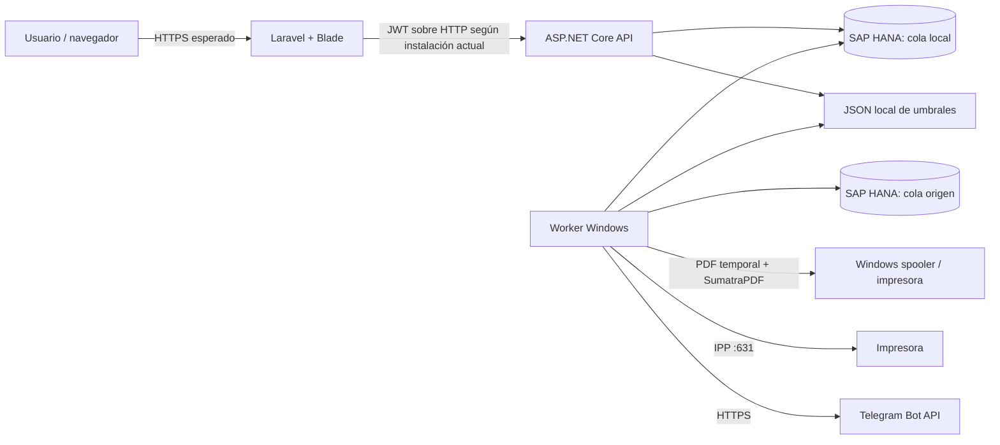

# Inventario técnico

**Proyecto:** ImpresorasServiceV1  
**Corte:** 2026-07-29  
**Commit:** `49a0b9691e484472fb1da23417de172f1e60473f` (`main`)  
**Naturaleza del inventario:** reconstruido desde el repositorio; los datos de producción no estaban disponibles.

## Dimensión del repositorio

| Tipo | Archivos | Líneas aproximadas |
| --- | ---: | ---: |
| C# | 109 | 12.490 |
| PHP/Blade | 86 | 10.493 |
| CSS | 3 | 8.400 |
| Markdown | 31 | 4.627 |
| JSON | 12 | 2.872 |
| PowerShell | 7 | 665 |
| SQL | 13 | 253 |

La solución contiene 4 proyectos .NET, 59 marcadores de ruta/endpoint en la API y 53 rutas Laravel. Los recuentos son métricas de inventario, no de complejidad ni cobertura.

## Aplicaciones y módulos

| Módulo | Tecnología | Responsabilidad observada | Entradas/salidas |
| --- | --- | --- | --- |
| `ImpresorasService.Api` | ASP.NET Core 8, EF Core, JWT | API administrativa y operativa; autenticación, CRUD, cola, reglas, dashboard, Telegram, salud y diagnóstico | HTTP/JSON; HANA |
| `ImpresorasService.Worker` | .NET Worker/Windows Service | Lock de instancia, ingesta, enrutado, impresión, watchdog IPP, conectividad y alertas | HANA origen/destino, Windows spooler, IPP, Telegram |
| `ImpresorasService.Core` | .NET 8 | Dominio, servicios de aplicación, adaptadores e infraestructura compartida | EF/HANA, ODBC, HTTP, filesystem, proceso SumatraPDF |
| `ImpresorasService.Web.PHP` | Laravel 12, Blade, PHP 8.2+, Vite 7/Tailwind 4 | BFF/interfaz administrativa; conserva JWT y usuario en sesión PHP y consume la API | Navegador ↔ Laravel ↔ API |
| `Api.IntegrationTests` | xUnit, WebApplicationFactory, SQLite | Integración API y pruebas de servicios con sustituciones locales | SQLite en memoria, dobles de prueba |

## Arquitectura y flujo de datos observado

### Límites de confianza

1. Navegador ↔ Laravel: cookie de sesión, CSRF de Laravel y datos de formularios.
2. Laravel ↔ API: JWT de 8 horas; el BFF reenvía la identidad y el ámbito de tienda.
3. API/Worker ↔ HANA: credenciales de servicio y esquema externo.
4. Worker ↔ spooler/IPP: efecto físico no transaccional y estado externo parcialmente observable.
5. Worker ↔ Telegram: tercero externo que recibe nombre/estado de tienda.
6. API ↔ filesystem compartido: reglas de umbral sin coordinación transaccional.

## Dominio y persistencia

`ImpresorasDbContext` expone:

- `PrintJobs` y `PrintJobEvents`.
- `SourcePrintJobs`.
- `Printers`, `RoutingRules`, `Stores`, `Users`.
- `DashboardThresholds`.
- `TelegramConfigs`, `TelegramChats`, `StoreAlertStates`.
- `WorkerLocks`.

La producción usa SAP HANA mediante `Sap.EntityFrameworkCore.Hana.v8.0` 2.28.19. Las migraciones EF históricas no constituyen por sí solas el esquema productivo: hay DDL y scripts HANA separados en `scripts/sql/`. No se obtuvo el catálogo real, sus índices, constraints, planes ni volumen.

## Procesos en segundo plano

| Proceso | Frecuencia/configuración | Función | Riesgo operativo principal |
| --- | --- | --- | --- |
| `WorkerLockBackgroundService` | lease/heartbeat configurables | Exclusión de Worker | Configuración inválida o pérdida del lease a mitad de ciclo |
| `IngestionBackgroundService` | polling + lote | Reclama origen, persiste y confirma | ACK incorrecto ante un error DB no duplicado |
| `PrintExecutionBackgroundService` | polling | Enruta/reintenta/envía PDF | Ventana no atómica con el spooler |
| `SpoolAcceptedWatchdogBackgroundService` | intervalo/edad/lote | Interpreta IPP y confirma | Estado de impresora no equivale a estado del trabajo |
| `PrinterConnectivityMonitorService` | periódico | TCP/IPP y estado de conectividad | Sondeo repetido por impresora |
| `StoreHealthAlertBackgroundService` | periódico | Calcula salud y alerta | N+1, persistencia antes del envío |

## API por área

| Área | Operaciones observadas | Protección principal |
| --- | --- | --- |
| Autenticación | login, bootstrap inicial | Rate limit `auth`; bootstrap solo Development |
| Usuarios | listar, crear, editar, borrar | Admin |
| Tiendas | listar, crear, editar, activar/desactivar, borrar/purgar | Employee para lectura; Admin para escritura |
| Impresoras | CRUD, estado/conectividad, prueba PDF | Políticas por rol/tienda |
| Reglas | CRUD y filtros | Admin |
| Cola/trabajos | listar/paginar, enrutar, reintentar, cancelar, acciones masivas | Employee/Admin con filtros de tienda |
| Dashboard | overview, umbrales | Employee/Admin |
| Telegram | configuración, chats, prueba | Admin |
| Diagnóstico | `/health`, `/diagnostics`, `/diagnostics/hana` | Salud pública; diagnóstico HANA Admin |

No existe versionado de API (`/api/v1`). Los contratos se acoplan directamente entre controladores PHP y DTO JSON de la API.

## Roles y ámbitos

| Rol | Ámbito aparente |
| --- | --- |
| `Admin` | Global, incluida configuración y CRUD |
| `StoreManager` | Tienda asignada |
| `Employee` | Tienda asignada y operaciones de cola/consulta |

La separación por tienda funciona como aislamiento lógico, aunque no se documenta formalmente como multitenancy. Hay rutas de lectura que fallan en abierto si falta el claim `StoreId`, y el listado de tiendas es global para roles no administradores.

## Integraciones

| Integración | Protocolo/dependencia | Credencial/configuración | Disponibilidad en auditoría |
| --- | --- | --- | --- |
| SAP HANA cola local | EF Core provider HANA | `ConnectionStrings__PrintQueue` | No |
| SAP HANA origen | ODBC/EF, claim token | `SapHana__ConnectionString` | No |
| Windows spooler | SumatraPDF + cola Windows | binario/ruta/nombre de cola | No |
| IPP | HTTP/TCP 631 | host de impresora | No |
| Telegram Bot API | HTTPS | bot token + chats | No; no se contactó |
| Sesión Laravel | filesystem por defecto del ejemplo | `APP_KEY`, cookie/session env | Solo tests |
| Umbrales dashboard | JSON local | `DashboardThresholdRules:Path` | Revisado estáticamente |

## Dependencias críticas fijadas

- .NET 8; EF Core 8.0.15; JWT Bearer 8.0.11; BCrypt.Net-Next 4.0.3; HANA provider 2.28.19; ODBC 10.0.7.
- Laravel bloqueado en 12.53.0; Guzzle 7.10.0; PSR-7 2.8.0; CommonMark 2.8.0.
- Vite 7.3.5 resuelto; Axios y Tailwind son dependencias de desarrollo/build.
- xUnit 2.9.2 y SQLite para pruebas.

Hay `composer.lock` y `package-lock.json`; NuGet fija versiones en los `.csproj`, pero no se observó lockfile de restore.

## Despliegue y operación

- Destino principal: Windows Services publicados `win-x64`.
- `install-windows-services.ps1` instala API y Worker, usa `LocalSystem` por defecto y guarda credenciales en el entorno del servicio bajo HKLM.
- La API se enlaza por defecto a `http://+:5105`.
- El proxy Nginx documentado es una referencia HTTP; no hay Docker, Kubernetes ni manifiestos de infraestructura.
- CI raíz: build/test .NET Release; Composer, Vite build y tests Laravel; limpieza del repositorio.
- No se encontró automatización verificable de backup/restore, rollback, rotación de secretos, despliegue blue/green ni smoke test HANA/impresora.

## Pruebas existentes

| Suite | Inventario | Resultado local |
| --- | ---: | --- |
| .NET/xUnit | 127 métodos con `[Fact]`/`[Theory]`; 142 casos ejecutados | 142/142 correctos |
| Laravel/PHPUnit | 12 métodos | 11 correctos, 1 fallo |
| Vite | build de producción | Correcto |

La suite .NET usa principalmente SQLite y dobles; no demuestra compatibilidad SQL/concurrencia HANA ni el efecto físico de impresión. No hay E2E navegador, pruebas de carga, seguridad automatizada, restauración ni caos/reinicio en CI.

## Documentación disponible

Existe README, despliegue, contrato KPI, auditorías/roadmaps anteriores, scripts HANA y documentos archivados. Faltan como runbooks operativos completos: backup/restauración, rotación de secretos, pérdida del Worker, recuperación de impresión ambigua, respuesta a incidentes y matriz soportada de HANA/driver/Sumatra.

