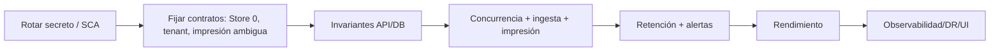

# Plan de remediación

**Base:** auditoría de 2026-07-29 sobre `49a0b9691e484472fb1da23417de172f1e60473f`.  
**Regla de avance:** cada cambio entra con check ejecutable estrecho y después gate de regresión. No mezclar refactors cosméticos con correcciones de integridad.

## Prioridad 0 — inmediata

| Orden | Hallazgo | Acción concreta | Responsable | Dependencias/riesgo | Esfuerzo | Verificación |
| ---: | --- | --- | --- | --- | --- | --- |
| 1 | AUD-01 | Revocar token con BotFather; emitir otro; almacenarlo solo en secret store/entorno; retirar la literal del documento | Seguridad + Operaciones | Puede interrumpir alertas; coordinar ventana | Bajo | Token antiguo falla, nuevo envía; secret scan árbol+historial |
| 2 | AUD-01 | Tras rotación, decidir y ejecutar reescritura Git coordinada; activar push protection/secret scanning | Responsable repo | Reescritura invalida clones/PR; no hacer antes de revocar | Medio | Ningún patrón/token real en ramas protegidas |
| 3 | AUD-02 | Actualización dirigida: Laravel ≥12.61.1, Guzzle ≥7.15.1, PSR-7 ≥2.12.3, CommonMark ≥2.8.2 | Backend PHP | Revisar constraints transitivos/API; evitar upgrade mayor | Bajo/Medio | `composer audit --locked` limpio; PHP 12/12; Vite; smoke login |

## Prioridad 1 — urgente

| Orden | Hallazgo | Acción concreta | Responsable | Dependencias/riesgo | Esfuerzo | Verificación |
| ---: | --- | --- | --- | --- | --- | --- |
| 4 | AUD-07 | Decidir si Store 0 es válido. Recomendación por evidencia: soportarlo en API/PHP/dashboard; centralizar `StoreId >= 0` | Producto + API + PHP | Cambio transversal; migraciones/datos | Medio | T-007 completo |
| 5 | AUD-08 | Validar que impresora activa pertenece a la tienda de la regla; constraint/servicio compartido; `CreatedBy` desde JWT | API/DB | Reglas globales requieren contrato explícito | Bajo/Medio | T-008 y migración de reglas inválidas |
| 6 | AUD-03 | Invariante atómica de último Admin usada por update/delete; impedir auto-democión si deja cero | API/DB | Carrera; quizá lock/transacción HANA | Medio | T-002/T-003 en HANA |
| 7 | AUD-09 | Clasificar violación única específica; añadir al ACK solo alta confirmada o duplicado comprobado | Core/DB | Códigos de error HANA | Medio | T-009/T-010 |
| 8 | AUD-12 | Implementar concurrencia efectiva: UPDATE condicional por `row_version`/estado y comprobar filas afectadas | Core/DB | Provider HANA no compara BLOB como EF token; usar SQL/columna compatible | Alto | T-013 con dos conexiones |
| 9 | AUD-10/AUD-11 | Política explícita para resultado físico ambiguo; capturar identificador del spool/IPP cuando sea posible; no reenviar `Printing` stale a ciegas | Producto + Worker | Exactly-once físico no garantizable; elegir duplicado/pérdida/revisión | Alto | T-011/T-012/T-014 |
| 10 | AUD-13 | Definir retención y limpiar BLOB de PrintJob/origen por estado/edad; job de purga con métricas | Privacidad + DB + Worker | No borrar antes de validar recuperación/auditoría | Medio | T-015 y restore |
| 11 | AUD-14 | Outbox/estado de entrega por alerta; persistir confirmación tras respuesta; reintentos acotados/idempotentes | Worker | Telegram puede aceptar y perderse respuesta | Medio | T-016 |

## Prioridad 2 — próximo ciclo

| Orden | Hallazgo | Acción | Responsable | Riesgo/esfuerzo | Pruebas |
| ---: | --- | --- | --- | --- | --- |
| 12 | AUD-04 | Policy/filtro central por identidad: roles de tienda sin claim ⇒ 403; limitar `Stores.GetAll` | API/Seguridad | Medio | Matriz rol×endpoint×tienda |
| 13 | AUD-06 | Regenerar sesión al login; invalidar+CSRF al logout; limpiar selección; diseñar revocación/versionado JWT | API/PHP | Medio | T-018/T-019 |
| 14 | AUD-05 | Particionar limiter por IP normalizada + login; límites/proxy confiable | API | Bajo | T-006 |
| 15 | AUD-16 | API en loopback o TLS; firewall; cuentas separadas y mínimas para API/Worker | Operaciones | Medio; permisos spool/HANA | Test remoto negativo + smoke impresión |
| 16 | AUD-15 | Semántica única de borrado; incluir chats/alert states o prohibir reutilizar ID; purga por lotes | API/DB/Producto | Medio/Alto | T-020/T-021 |
| 17 | AUD-17 | Resolver reglas una vez por lote o consulta filtrada | Core/DB | Medio | T-P01 + tests de precedencia |
| 18 | AUD-18 | Agregar dashboard en HANA y capturar planes | API/DB | Medio | T-P02, contrato KPI |
| 19 | AUD-19 | Snapshot agrupado de alertas; un `SaveChanges` por ciclo | Worker/DB | Medio | T-P03 y equivalencia salud |
| 20 | AUD-20 | Escritura JSON temp+replace+lock; mover a HANA si multi-host | Core/Operaciones | Bajo/Medio | T-024 |
| 21 | AUD-21 | No convertir fallo API en `[]`; modelar resultado/error; mostrar “no disponible”, no cero | PHP/UX | Medio | T-022/T-023 |
| 22 | AUD-23 | Alinear prueba de acciones tienda 0 con contrato accesible; añadir E2E/a11y | PHP/QA | Bajo/Medio | PHP 12/12 + E2E |

## Prioridad 3 — mejora continua

| Orden | Hallazgo | Acción | Responsable | Esfuerzo | Verificación |
| ---: | --- | --- | --- | --- | --- |
| 23 | AUD-22 | Métricas, tracing/correlation scope, readiness/liveness y alertas técnicas | Plataforma | Medio | Dashboard/alertas de observabilidad |
| 24 | AUD-22 | Runbooks backup/restore, DR, rotación, Worker perdido e impresión ambigua; ensayo trimestral | Operaciones | Medio | Restore medido contra RPO/RTO |
| 25 | AUD-24 | CSP/HSTS/Permissions-Policy; codificación DOM; ocultar detalle HANA | Seguridad/Frontend | Bajo/Medio | T-S02/T-S03/T-S07 |
| 26 | AUD-20 | Reducir duplicación dashboard PHP/API y dividir módulos grandes por comportamiento | API/PHP | Medio | Contrato KPI + diff visual |
| 27 | AUD-17/AUD-18 | Baseline continuo de rendimiento y presupuestos | Plataforma/DB | Medio | Benchmarks reproducibles |
| 28 | AUD-02 | Actualizar SQLite de tests cuando la cadena corregida esté disponible; SBOM y pin SHA de Actions | DevSecOps | Bajo | SCA/SBOM CI |

## Mejoras rápidas de alto impacto

1. Añadir test de democión de último Admin antes de tocar el controlador.
2. Hacer fallar startup si `HeartbeatSeconds >= LeaseSeconds` o lease ≤0.
3. Cambiar el log “Alerta enviada” para que solo exista tras confirmación real; hasta el outbox, no marcarla enviada si todos los chats fallan.
4. Limitar y validar arrays de acciones masivas y `page`.
5. Sustituir el detalle de excepción HANA por un correlation ID.
6. Añadir `composer audit`, `npm audit --omit=dev` y `dotnet list package --vulnerable` al CI con política documentada.
7. Documentar explícitamente que el `Legacy` está excluido del `.csproj`, evitando tratarlo como implementación activa.

## Secuencia de cambios y dependencias

No optimizar el resolver antes de imponer pertenencia tienda-impresora; no limpiar BLOB antes de aprobar retención/recuperación; no reescribir historial antes de revocar el secreto.

## Definition of Done por acción

- Test que reproduce el fallo antes y pasa después.
- Compatibilidad HANA validada cuando interviene SQL/concurrencia/tipos.
- Sin regresión en `dotnet test`, `php artisan test` y `npm run build` según componente.
- Migración y rollback/forward-fix documentados.
- Métrica/log suficientes para detectar fallo.
- Documentación y matriz de trazabilidad actualizadas.
- Revisión de seguridad para P0/P1 y de negocio para semántica de impresión/retención.

## Decisiones que requieren propietario

1. ¿`StoreId = 0` forma parte del dominio válido?
2. Ante resultado físico desconocido, ¿se prioriza evitar duplicado, evitar pérdida o revisión humana?
3. ¿Cuánto tiempo se conserva el PDF en origen, cola, temporales y backups?
4. ¿Cuál es el aislamiento por tienda esperado para listados globales?
5. ¿RPO, RTO, volumen pico y SLO del dashboard/cola?

